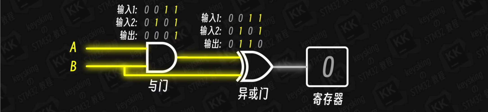
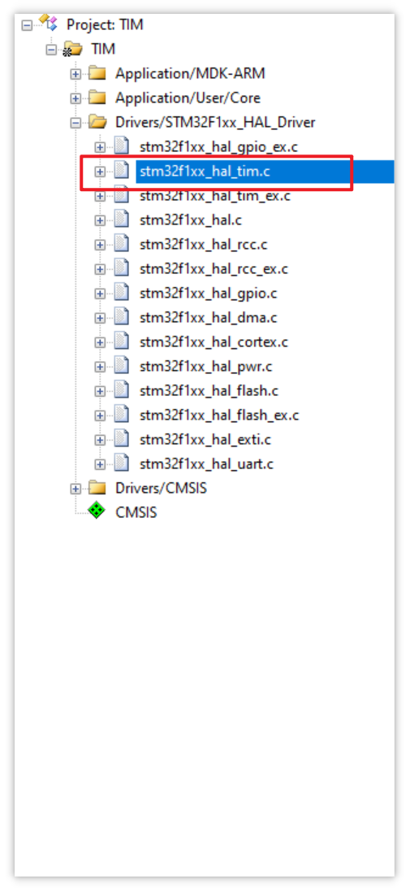

# TIM 定时器


## 时钟树&时钟源

### 逻辑电路中门电路运算的延时

在逻辑电路中，门电路涉及 MOS 管的充放电过程，该过程比电信号的光速传播慢得多，这就会导致门电路运算的延时。

如下图，一开始 A、B 都输出高电平，经过与门和异或门，最终输出低电平到寄存器：



随后 B 跳变到低电平，B 的分支瞬间将低电平传播到异或门，但此时与门仍在运算中，尚未将与门的输出切换为低电平，异或门就有可能错误地输出高电平（当然异或门的运算也需要耗费时间，但无法保证异或门不会在某一时刻输出错误的电平）：


当门电路都运算完成，电路的电平信号稳定下来，最终将正确地输出低电平到寄存器：


在上述过程中，寄存器在某一时间段中出现了由门电路运算延时而产生地错误状态，这会导致依赖此寄存器状态的逻辑电路产生一连串的错误，从而影响程序。

解决此问题的方法是加入一个边沿触发器，为其 CLK 控制端接入一个固定频率的方波信号，并有如下规定：

- 在方波信号的上升沿，边沿触发器将采集输入端（D）的电平信号，通过输出端（Q）输出到寄存器
- 在方波信号一个周期内的其它时刻，边沿触发器不会采集门电路延时运算的过程中产生的错误电平，并且保持其输出端电平不变


上述边沿触发器接入的方波信号，即**时钟信号**，由单片机的**时钟源**产生，通过**时钟树**传播到整个芯片中。 

依赖时钟信号的外设包括但不限于：

- 串口：波特率
- IIC/SPI：时钟线
- 定时器：计时
- ADC：采样间隔


### 时钟树与时钟源主要结构


## 基本定时功能

定时器的本质就是计数器。

STM32F103系列的定时器分类：

- 基本定时器：TIM6、TIM7
- 通用定时器：TIM2、TIM3、TIM4、TIM5
- 高级定时器：TIM1、TIM8

STM32F103C8T6 只有 TIM1 ~ TIM4 四个定时器。

### 如何设置定时器

假设使用 TIM4 通用定时器，在 CubeMX 中需要做如下配置：

1. 配置系统频率为 72MHz，并且注意到 APB1 的定时器时钟频率为 72 MHz，TIM4 的时钟与该频率一致：

   

2. 配置高速时钟为外部晶振，使用 Serial Wire 调试：

   

3. 勾选内部时钟源：

   

4. 根据 APB1 的时钟频率，设置预分频值为 7199，重装载值为 9999：

   

如下图所示，假设 APB1 时钟频率为 72MHz，即每 1/72000000 秒产生一个时钟方波信号输入到 TIM4 的预分频器，将预分频器设置为 7199，则预分频器每接收 7200 个时钟方波（每经历 1/10000 秒），就会输出 1 个方波信号到计数器。

此时可以将自动重装载寄存器设置为 9999，这样计数器每接收到一个来自预分频器的方波信号（每经历 1/10000 秒），其计数值便累加 1，直到累加到 9999，下一次接收到方波信号时，计数值重置为 0，并产生一次定时器中断，此时距离上一次重置计数值经过了 1 秒，就可以实现每 1 秒更新一次定时器。


### 如何启用定时器

**函数原型**

```c
__HAL_TIM_SET_PRESCALER(...);   /* 设置预分频器的值 */

__HAL_TIM_GET_AUTORELOAD(...);  /* 获取自动重装载寄存器的值 */
__HAL_TIM_SET_AUTORELOAD(...);  /* 设置自动重装载寄存器的值 */

__HAL_TIM_GET_COUNTER(...);     /* 获取计数器的值 */
__HAL_TIM_SET_COUNTER(...);     /* 设置计数器的值 */

HAL_TIM_Base_Start(&htim4);     /* 启动 TIM4 定时器 */
```

**预分频器的影子寄存器**

其实真正的方波信号并不是通过预分频器到达计数器的，而是通过影子寄存器，如图：


当程序正在运行，计数器正在累加计数值时，改变了预分频器的值，这个预分频值并不会马上应用到影子寄存器：

- 此时计数器大概率尚未重置为 0，计数值仍然会根据原来的预分频值（7199）累加到自动重装载寄存器的值（9999）
- 当计数器重置为 0 时，新的预分频值才会应用到影子寄存器中，此时计数器根据新的方波信号来累加计数值

概括起来就是：新的预分频值要等下一个计数周期才会生效，避免影响当前计数周期

**自动重装载寄存器的影子寄存器**

与预分频器类似，自动重装载寄存器也有影子寄存器，其目的也是让新的重装载值等到下一个计数周期再生效


与预分频器影子寄存器不同的是，自动重装载影子寄存器默认是关闭的，可以通过 CubeMX 的 `auto-reload preload` 选项打开：


如果不打开自动重装载寄存器的影子寄存器，假如设置了重装载值时，计数器中的值恰好比新的重装载值大，计数器将一直累加，直到计数值达到最大值 65535 才会重置为 0：


### 如何实现定时器中断

CubeMX 中使能定时器的 NVIC 中断：


启动定时器时加上 `IT` 后缀：


定时器的中断回调函数是虚函数，可以重写：


该函数在 keil 工程中的位置：



重写 TIM4 的定时器中断回调函数，打印调试信息：

```c
/* 定时器 TIM4 中断回调函数 */
void HAL_TIM_PeriodElapsedCallback(TIM_HandleTypeDef *htim)
{
  char *data = "TIM4_PeriodElapsedCallback";

  /* 判断当前发生的定时器中断是否来自 TIM4 */
  if (htim == &htim4)
  {
	HAL_UART_Transmit_IT(&huart1, (uint8_t*)data, strlen(data));
  }
}
```

调试运行，每秒打印一次信息：


测试代码保存在： [TIM_Interrupt](./source/TIM_Interrupt) 


## PWM

1. PWM：使用数字信号模拟模拟信号

   

2. 频率 = 1 / 周期

   占空比 = 高电平 / 周期

   