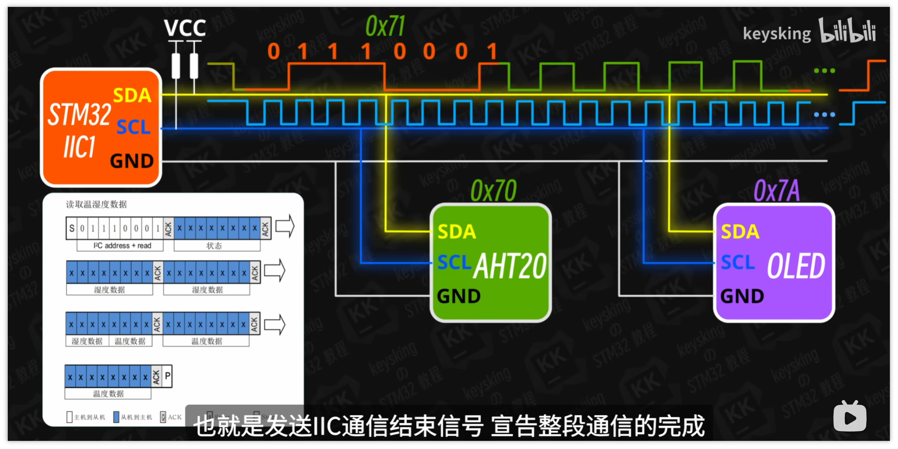
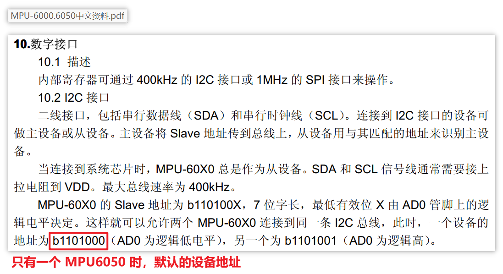
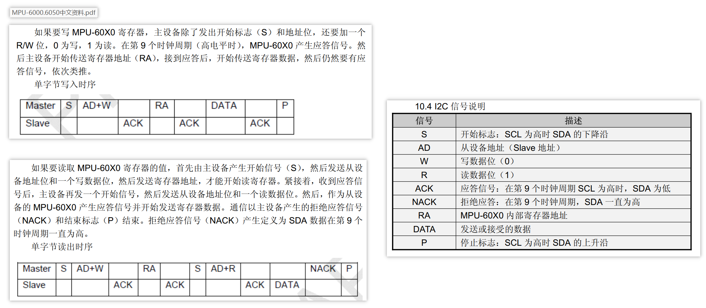
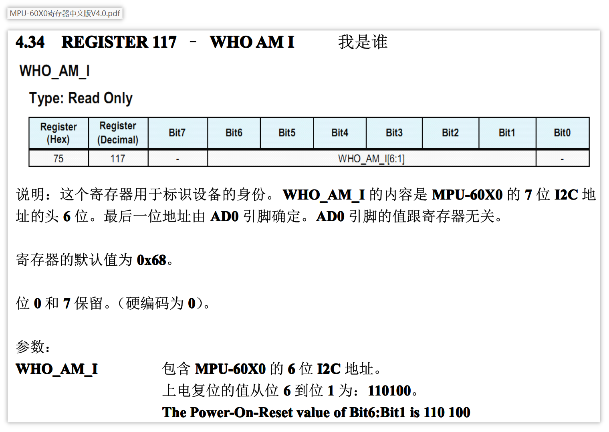

## I2C 通信协议概述



## 关键词

​	IIC，半双工通信，同步通信，一主多从模式，时钟线（SCL），数据线（SDA）

## 通信过程

**以 STM32 从 AHT20 温湿度模块获取数据为例**

- 时钟线和数据线接上拉电阻，平时处于高电平状态
- 在时钟线处于高电平时，主机将数据线电平拉低，通信开始，时钟线将会产生周期性脉冲
- 主机首先要选中从机，从而与之通信
  - 主机会在时钟线的脉冲为低电平时，根据从机的二进制设备号来设置数据线的电平
  - 从机会在时钟线的脉冲为高电平时，读数据线的电平信号
  - 直到主机发送完 8 位（1 字节）的设备号（**从高位到低位发送**）
  - 连接到 IIC 总线的所有设备都会感应到电平变化，但只有符合主机发送的设备号的模块，才会有响应
- 从机应答（ACK）
  - 假如从机 AHT20 从数据线上读到了自己的设备号，会在时钟线为低电平时，拉低数据线电平，表示准备好与主机通信
- 从机发送数据
  - 时钟线仍然由主机控制
  - 数据线控制权转交给从机
  - 从机根据要发送的数据，在时钟线脉冲为低电平时，设置数据线的电平
  - 主机在时钟线为高电平时，读数据线的电平
- 主机应答（ACK）
  - 从机每发送 1 字节数据，主机发送一次应答信号（也是在时钟线为低电平时，拉低数据线电平）
- 主机发送通信结束信号
  - 主机在时钟线为高电平时，将数据线电平拉高，表示通信结束


## 通信过程总结

- 只有在主机发送通信开始或结束信号时，会在时钟线为高电平时控制数据线的电平
  - 开始信号：时钟线高电平时，主机拉低数据线电平
  - 结束信号：时钟线高电平时，主机拉高数据线电平
- 发送方每发送 1 个字节时，接收方总要应答一次
  - 应答信号：时钟线低电平时，接受方拉低数据线电平
- 传输数据时
  - 发送方在时钟线为低电平时拉高（传输 1）或拉低（传输 0）数据线电平
  - 接收方在时钟线为高电平时读数据线电平


## MPU6050 陀螺仪

**MPU6050 参考资料**

- [MPU6000_MPU6050手册](../doc/MPU6000_MPU6050手册) 

**MPU6050 设备地址** 

MPU6050 的设备地址为 7 位的 `0x68`



**MPU6050 通信过程**



### 读 MPU6050 的寄存器



如上图，读取寄存器 `0x75` 的 0 到 7 位可以得到 MPU6050 的 I2C 设备地址 `0x68`。

本次实验将读此寄存器的值，验证设备地址。


#### 查询方式

函数原型：

```c
/* 查询方式写 I2C 设备 */
HAL_StatusTypeDef HAL_I2C_Master_Transmit(I2C_HandleTypeDef *hi2c, uint16_t DevAddress, uint8_t *pData, uint16_t Size, uint32_t Timeout);
HAL_StatusTypeDef HAL_I2C_Mem_Write(I2C_HandleTypeDef *hi2c, uint16_t DevAddress, uint16_t MemAddress, uint16_t MemAddSize, uint8_t *pData, uint16_t Size, uint32_t Timeout);

/* 查询方式读 I2C 设备 */
HAL_StatusTypeDef HAL_I2C_Master_Receive(I2C_HandleTypeDef *hi2c, uint16_t DevAddress, uint8_t *pData, uint16_t Size, uint32_t Timeout);
HAL_StatusTypeDef HAL_I2C_Mem_Read(I2C_HandleTypeDef *hi2c, uint16_t DevAddress, uint16_t MemAddress, uint16_t MemAddSize, uint8_t *pData, uint16_t Size, uint32_t Timeout);
```


#### 实验代码

 [MPU6050_WHO_AM_I](../source/MPU6050_WHO_AM_I) 